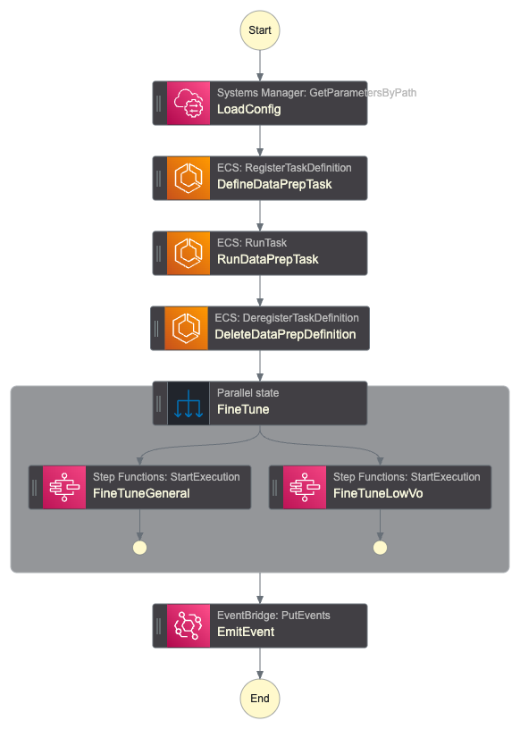

# Fine Tune Workflow

This module manages the pipeline for fine tuning the BERT model. This is primarily managed by the Step Function state machine.

## Flow

The workflow loads some basic configuration from SSM Parameter store, including the container image versions to use. The ECR task for preparing the data runs. This extracts the ticket data from the databse. It is split into general and low volume ticket groups before being split into training and test data sets. Finally the data is written to S3.

Next the model fine tune jobs are triggered. These run in parallel.

When the jobs are complete an event is ommited.

# Generated Terraform Documentation

<!-- BEGIN_TF_DOCS -->
## Requirements

| Name | Version |
|------|---------|
|  [terraform](#requirement\_terraform) | >= 1.11.0, < 2.0.0 |
|  [aws](#requirement\_aws) | >= 6.0, < 7.0 |

## Providers

| Name | Version |
|------|---------|
|  [aws](#provider\_aws) | >= 6.0, < 7.0 |

## Modules

No modules.

## Resources

| Name | Type |
|------|------|
| [aws_cloudwatch_log_group.ecs_data_prep](https://registry.terraform.io/providers/hashicorp/aws/latest/docs/resources/cloudwatch_log_group) | resource |
| [aws_cloudwatch_log_group.sfn](https://registry.terraform.io/providers/hashicorp/aws/latest/docs/resources/cloudwatch_log_group) | resource |
| [aws_iam_policy.data_prep_exec](https://registry.terraform.io/providers/hashicorp/aws/latest/docs/resources/iam_policy) | resource |
| [aws_iam_policy.data_prep_task](https://registry.terraform.io/providers/hashicorp/aws/latest/docs/resources/iam_policy) | resource |
| [aws_iam_policy.sfn](https://registry.terraform.io/providers/hashicorp/aws/latest/docs/resources/iam_policy) | resource |
| [aws_iam_role.data_prep_exec](https://registry.terraform.io/providers/hashicorp/aws/latest/docs/resources/iam_role) | resource |
| [aws_iam_role.data_prep_task](https://registry.terraform.io/providers/hashicorp/aws/latest/docs/resources/iam_role) | resource |
| [aws_iam_role.sfn](https://registry.terraform.io/providers/hashicorp/aws/latest/docs/resources/iam_role) | resource |
| [aws_iam_role_policy_attachment.data_prep_exec](https://registry.terraform.io/providers/hashicorp/aws/latest/docs/resources/iam_role_policy_attachment) | resource |
| [aws_iam_role_policy_attachment.data_prep_task](https://registry.terraform.io/providers/hashicorp/aws/latest/docs/resources/iam_role_policy_attachment) | resource |
| [aws_iam_role_policy_attachment.sfn](https://registry.terraform.io/providers/hashicorp/aws/latest/docs/resources/iam_role_policy_attachment) | resource |
| [aws_security_group.this](https://registry.terraform.io/providers/hashicorp/aws/latest/docs/resources/security_group) | resource |
| [aws_sfn_state_machine.finetune](https://registry.terraform.io/providers/hashicorp/aws/latest/docs/resources/sfn_state_machine) | resource |
| [aws_vpc_security_group_egress_rule.egress_https](https://registry.terraform.io/providers/hashicorp/aws/latest/docs/resources/vpc_security_group_egress_rule) | resource |
| [aws_vpc_security_group_egress_rule.egress_https_all](https://registry.terraform.io/providers/hashicorp/aws/latest/docs/resources/vpc_security_group_egress_rule) | resource |
| [aws_vpc_security_group_egress_rule.egress_https_s3](https://registry.terraform.io/providers/hashicorp/aws/latest/docs/resources/vpc_security_group_egress_rule) | resource |
| [aws_caller_identity.current](https://registry.terraform.io/providers/hashicorp/aws/latest/docs/data-sources/caller_identity) | data source |
| [aws_ec2_managed_prefix_list.s3](https://registry.terraform.io/providers/hashicorp/aws/latest/docs/data-sources/ec2_managed_prefix_list) | data source |
| [aws_iam_policy_document.data_prep_exec](https://registry.terraform.io/providers/hashicorp/aws/latest/docs/data-sources/iam_policy_document) | data source |
| [aws_iam_policy_document.data_prep_task](https://registry.terraform.io/providers/hashicorp/aws/latest/docs/data-sources/iam_policy_document) | data source |
| [aws_iam_policy_document.ecs_exec_assume](https://registry.terraform.io/providers/hashicorp/aws/latest/docs/data-sources/iam_policy_document) | data source |
| [aws_iam_policy_document.ecs_task_assume](https://registry.terraform.io/providers/hashicorp/aws/latest/docs/data-sources/iam_policy_document) | data source |
| [aws_iam_policy_document.sfn](https://registry.terraform.io/providers/hashicorp/aws/latest/docs/data-sources/iam_policy_document) | data source |
| [aws_iam_policy_document.sfn_assume](https://registry.terraform.io/providers/hashicorp/aws/latest/docs/data-sources/iam_policy_document) | data source |
| [aws_partition.current](https://registry.terraform.io/providers/hashicorp/aws/latest/docs/data-sources/partition) | data source |
| [aws_region.current](https://registry.terraform.io/providers/hashicorp/aws/latest/docs/data-sources/region) | data source |
| [aws_subnet.this](https://registry.terraform.io/providers/hashicorp/aws/latest/docs/data-sources/subnet) | data source |

## Inputs

| Name | Description | Type | Default | Required |
|------|-------------|------|---------|:--------:|
|  [application\_name](#input\_application\_name) | Name for the application. Used to prefix resources provisioned by this module. | `string` | `"gata"` | no |
|  [db\_cluster\_arn](#input\_db\_cluster\_arn) | ARN of the existing RDS Aurora cluster | `string` | n/a | yes |
|  [db\_secret\_arn](#input\_db\_secret\_arn) | ARN of the existing RDS Aurora secret | `string` | n/a | yes |
|  [ecr\_repo\_arns](#input\_ecr\_repo\_arns) | ARNs of the ECR repositories for the docker images. Format: { module\_name => repo\_arn } | `map(string)` | n/a | yes |
|  [ecr\_repo\_urls](#input\_ecr\_repo\_urls) | URLs of the ECR repositories for the docker images. Format: { module\_name => repo\_url } | `map(string)` | n/a | yes |
|  [ecs\_cluster\_arn](#input\_ecs\_cluster\_arn) | ARN of the existing ECS cluster | `string` | n/a | yes |
|  [event\_bus\_name](#input\_event\_bus\_name) | ARN of the EventBridge event bus to use for notifications | `string` | n/a | yes |
|  [kms\_key\_arn](#input\_kms\_key\_arn) | ARN of the KMS key to use for encryption | `string` | n/a | yes |
|  [low\_volume\_fallback\_label](#input\_low\_volume\_fallback\_label) | Label to use when there is insufficient low volume ticket data to train a model. | `number` | n/a | yes |
|  [role\_namespace](#input\_role\_namespace) | Namespace/prefix for IAMs roles | `string` | `""` | no |
|  [role\_permissions\_boundary](#input\_role\_permissions\_boundary) | Permissions boundary to apply to IAM roles | `string` | `null` | no |
|  [s3\_bucket\_name](#input\_s3\_bucket\_name) | Name of the S3 bucket to use for data storage | `string` | n/a | yes |
|  [sfn\_arns](#input\_sfn\_arns) | ARNs of the Step Functions state machines for finetuning individual models. Format: { model\_name => sfn\_arn } | `map(string)` | n/a | yes |
|  [ssm\_image\_path](#input\_ssm\_image\_path) | The base SSM path for image versions parameters. | `string` | n/a | yes |
|  [subnet\_ids](#input\_subnet\_ids) | Subnet IDs for the ECR task | `list(string)` | n/a | yes |
|  [tags](#input\_tags) | Tags to apply to all resources | `map(string)` | `{}` | no |
|  [vpc\_endpoint\_security\_groups](#input\_vpc\_endpoint\_security\_groups) | Map of VPC endpoint security groups - `vpce => security_group_id` | `map(string)` | n/a | yes |

## Outputs

| Name | Description |
|------|-------------|
|  [ecs\_role\_exec\_name](#output\_ecs\_role\_exec\_name) | Name of the IAM execution role for data prep ECS task |
|  [ecs\_role\_task\_name](#output\_ecs\_role\_task\_name) | Name of the IAM task role for data prep ECS task |
|  [security\_group](#output\_security\_group) | ID of the security group used by the ECS task |
<!-- END_TF_DOCS -->