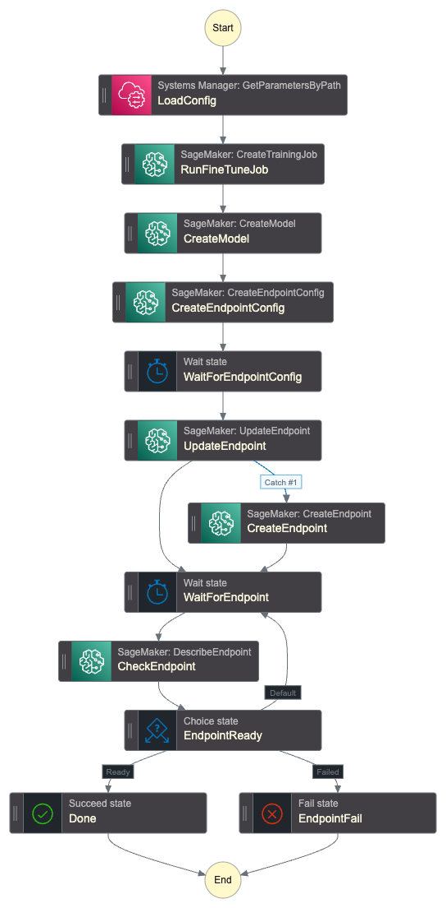

# Model Workflow

Orchestrates the fine-tuning and deployment of BERT models using SageMaker. The workflow is executed via Step Functions and handles both the training job and serverless endpoint creation.

## Purpose

This module creates the infrastructure to:

1. Fine-tune BERT models on prepared ticket data using SageMaker training jobs
2. Deploy the trained model to a SageMaker serverless endpoint for inference
3. Manage the complete model lifecycle from training to production deployment

The module is instantiated twice in the root configuration to support two model types:

- **General model** - Trained on all ticket categories for comprehensive routing
- **Low-volume model** - Specialized model for categories with limited historical data

## Workflow Steps

The Step Functions workflow executes:

1. Validates input parameters (batch ID, model paths)
2. Launches SageMaker training job with specified container image
3. Waits for training completion
4. Deploys or updates the serverless inference endpoint
5. Returns the endpoint ARN for use by routing workflows

## Configuration

Training jobs use:

- **Instance type**: ml.g6.xlarge (GPU-enabled for BERT fine-tuning)
- **Spot instances**: Configurable via `train_on_spot` variable for cost optimization
- **Max execution time**: Configurable via `finetune_max_exec` variable (default 7200 seconds)

Serverless endpoints automatically scale based on inference demand.

## Container Images

The workflow requires two ECR container images:

- **Fine-tune image** - Contains training code and dependencies
- **Inference image** - Contains model serving code

Image tags are managed via SSM parameters to enable zero-downtime updates.

# Generated Terraform Documentation

<!-- BEGIN_TF_DOCS -->
## Requirements

| Name | Version |
|------|---------|
|  [terraform](#requirement\_terraform) | >= 1.11.0, < 2.0.0 |
|  [aws](#requirement\_aws) | >= 6.0, < 7.0 |

## Providers

| Name | Version |
|------|---------|
|  [aws](#provider\_aws) | >= 6.0, < 7.0 |

## Modules

No modules.

## Resources

| Name | Type |
|------|------|
| [aws_cloudwatch_log_group.sfn_model_pipeline](https://registry.terraform.io/providers/hashicorp/aws/latest/docs/resources/cloudwatch_log_group) | resource |
| [aws_iam_policy.sagemaker_finetune](https://registry.terraform.io/providers/hashicorp/aws/latest/docs/resources/iam_policy) | resource |
| [aws_iam_policy.sagemaker_inference](https://registry.terraform.io/providers/hashicorp/aws/latest/docs/resources/iam_policy) | resource |
| [aws_iam_policy.sfn_model_pipeline](https://registry.terraform.io/providers/hashicorp/aws/latest/docs/resources/iam_policy) | resource |
| [aws_iam_role.sagemaker_finetune](https://registry.terraform.io/providers/hashicorp/aws/latest/docs/resources/iam_role) | resource |
| [aws_iam_role.sagemaker_inference](https://registry.terraform.io/providers/hashicorp/aws/latest/docs/resources/iam_role) | resource |
| [aws_iam_role.sfn_model_pipeline](https://registry.terraform.io/providers/hashicorp/aws/latest/docs/resources/iam_role) | resource |
| [aws_iam_role_policy_attachment.sagemaker_finetune](https://registry.terraform.io/providers/hashicorp/aws/latest/docs/resources/iam_role_policy_attachment) | resource |
| [aws_iam_role_policy_attachment.sagemaker_inference](https://registry.terraform.io/providers/hashicorp/aws/latest/docs/resources/iam_role_policy_attachment) | resource |
| [aws_iam_role_policy_attachment.sfn_model_pipeline](https://registry.terraform.io/providers/hashicorp/aws/latest/docs/resources/iam_role_policy_attachment) | resource |
| [aws_sfn_state_machine.model_pipeline](https://registry.terraform.io/providers/hashicorp/aws/latest/docs/resources/sfn_state_machine) | resource |
| [aws_caller_identity.current](https://registry.terraform.io/providers/hashicorp/aws/latest/docs/data-sources/caller_identity) | data source |
| [aws_iam_policy_document.sagemaker_assume](https://registry.terraform.io/providers/hashicorp/aws/latest/docs/data-sources/iam_policy_document) | data source |
| [aws_iam_policy_document.sagemaker_finetune](https://registry.terraform.io/providers/hashicorp/aws/latest/docs/data-sources/iam_policy_document) | data source |
| [aws_iam_policy_document.sagemaker_inference](https://registry.terraform.io/providers/hashicorp/aws/latest/docs/data-sources/iam_policy_document) | data source |
| [aws_iam_policy_document.sfn_model_pipeline](https://registry.terraform.io/providers/hashicorp/aws/latest/docs/data-sources/iam_policy_document) | data source |
| [aws_iam_policy_document.sfn_model_pipeline_assume](https://registry.terraform.io/providers/hashicorp/aws/latest/docs/data-sources/iam_policy_document) | data source |
| [aws_partition.current](https://registry.terraform.io/providers/hashicorp/aws/latest/docs/data-sources/partition) | data source |
| [aws_region.current](https://registry.terraform.io/providers/hashicorp/aws/latest/docs/data-sources/region) | data source |

## Inputs

| Name | Description | Type | Default | Required |
|------|-------------|------|---------|:--------:|
|  [bucket\_data\_arn](#input\_bucket\_data\_arn) | ARN of the S3 bucket containing the training data. | `string` | n/a | yes |
|  [bucket\_data\_name](#input\_bucket\_data\_name) | Name of the S3 bucket containing the training data. | `string` | n/a | yes |
|  [bucket\_model\_arn](#input\_bucket\_model\_arn) | ARN of the S3 bucket used for storing the model artifacts. | `string` | n/a | yes |
|  [bucket\_model\_name](#input\_bucket\_model\_name) | Name of the S3 bucket used for storing the model artifacts. | `string` | n/a | yes |
|  [finetune\_image\_arn](#input\_finetune\_image\_arn) | ARN of the ECR image to use for fine-tuning | `string` | n/a | yes |
|  [finetune\_image\_url](#input\_finetune\_image\_url) | The URL of the ECR image to use for fine-tuning | `string` | n/a | yes |
|  [finetune\_instance\_type](#input\_finetune\_instance\_type) | Instance type to use for fine-tuning | `string` | `"ml.g6.xlarge"` | no |
|  [finetune\_max\_exec](#input\_finetune\_max\_exec) | Maximum execution time for the fine-tuning job | `number` | n/a | yes |
|  [inference\_image\_arn](#input\_inference\_image\_arn) | ARN of the ECR image to use for inference | `string` | n/a | yes |
|  [inference\_image\_url](#input\_inference\_image\_url) | The URL of the ECR image to use for inference | `string` | n/a | yes |
|  [kms\_key\_arn](#input\_kms\_key\_arn) | The ARN of the KMS key to use for encryption at rest | `string` | n/a | yes |
|  [log\_retention\_days](#input\_log\_retention\_days) | Number of days to retain logs in CloudWatch Logs | `number` | n/a | yes |
|  [model\_namespace](#input\_model\_namespace) | Namespace used by this model | `string` | `"gata"` | no |
|  [role\_namespace](#input\_role\_namespace) | Namespace/prefix for the IAM roles | `string` | `""` | no |
|  [role\_permissions\_boundary](#input\_role\_permissions\_boundary) | Permissions boundary to apply to IAM roles | `string` | `""` | no |
|  [ssm\_image\_path](#input\_ssm\_image\_path) | The base SSM path for image versions parameters. | `string` | n/a | yes |
|  [tags](#input\_tags) | Tags to apply to all resources | `map(string)` | `{}` | no |
|  [train\_on\_spot](#input\_train\_on\_spot) | Use spot instances for fine tuning the models. | `bool` | n/a | yes |

## Outputs

| Name | Description |
|------|-------------|
|  [endpoint\_arn](#output\_endpoint\_arn) | ARN of the SageMaker endpoint created by the workflow |
|  [sfn\_arn](#output\_sfn\_arn) | ARN of the model workflow Step Function |
<!-- END_TF_DOCS -->