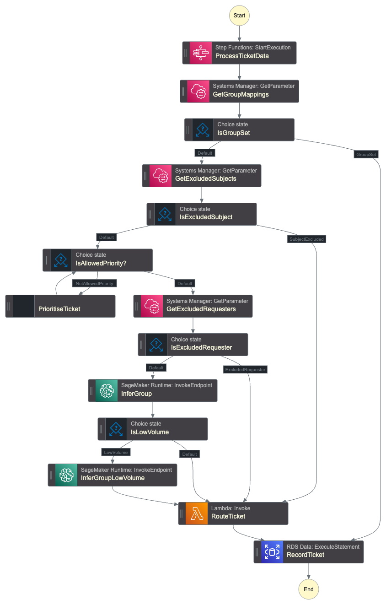

# Assigned Ticket Workflow

Processes tickets that are assigned to a support group for the first time. This workflow prioritizes the ticket and updates it in Zendesk.

## Purpose

When a ticket is assigned to a support group (either manually or by another system), this workflow:

1. Retrieves the full ticket data including comments
2. Prioritizes the ticket using Amazon Nova Micro
3. Updates the ticket priority in Zendesk
4. Records the assignment event for tracking and model training

This workflow complements the new ticket workflow. Tickets that bypass the new ticket routing (e.g., manually assigned, or assigned by external integrations) still receive proper prioritization.

## Triggering

The workflow is triggered by EventBridge when a `ticket.group_assignment_changed` event is received from Zendesk where the previous group assignment was null (indicating first assignment).

## Configuration

The workflow uses the following SSM parameters:

- **Exclude requesters** - List of requester IDs to exclude from processing
- **Exclude subjects** - Subject line patterns to exclude from processing
- **Group mappings** - Mapping of Zendesk group IDs to labels for model inference

## Model Inference

The workflow invokes SageMaker serverless endpoints to predict ticket priority. It supports both general and low-volume routing models, selecting the appropriate endpoint based on ticket characteristics.

# Generated Terraform Documentation

<!-- BEGIN_TF_DOCS -->
## Requirements

| Name | Version |
|------|---------|
|  [terraform](#requirement\_terraform) | >= 1.11.0, < 2.0.0 |
|  [aws](#requirement\_aws) | >= 6.0, < 7.0 |

## Providers

| Name | Version |
|------|---------|
|  [aws](#provider\_aws) | >= 6.0, < 7.0 |

## Modules

No modules.

## Resources

| Name | Type |
|------|------|
| [aws_cloudwatch_event_rule.assigned_ticket](https://registry.terraform.io/providers/hashicorp/aws/latest/docs/resources/cloudwatch_event_rule) | resource |
| [aws_cloudwatch_event_target.assigned_ticket](https://registry.terraform.io/providers/hashicorp/aws/latest/docs/resources/cloudwatch_event_target) | resource |
| [aws_cloudwatch_log_group.sfn_new_ticket](https://registry.terraform.io/providers/hashicorp/aws/latest/docs/resources/cloudwatch_log_group) | resource |
| [aws_iam_policy.eb_assigned_ticket](https://registry.terraform.io/providers/hashicorp/aws/latest/docs/resources/iam_policy) | resource |
| [aws_iam_policy.sfn_new_ticket](https://registry.terraform.io/providers/hashicorp/aws/latest/docs/resources/iam_policy) | resource |
| [aws_iam_role.eb_assigned_ticket](https://registry.terraform.io/providers/hashicorp/aws/latest/docs/resources/iam_role) | resource |
| [aws_iam_role.sfn_new_ticket](https://registry.terraform.io/providers/hashicorp/aws/latest/docs/resources/iam_role) | resource |
| [aws_iam_role_policy_attachment.eb_assigned_ticket](https://registry.terraform.io/providers/hashicorp/aws/latest/docs/resources/iam_role_policy_attachment) | resource |
| [aws_iam_role_policy_attachment.sfn_new_ticket](https://registry.terraform.io/providers/hashicorp/aws/latest/docs/resources/iam_role_policy_attachment) | resource |
| [aws_sfn_state_machine.this](https://registry.terraform.io/providers/hashicorp/aws/latest/docs/resources/sfn_state_machine) | resource |
| [aws_bedrock_foundation_model.priority](https://registry.terraform.io/providers/hashicorp/aws/latest/docs/data-sources/bedrock_foundation_model) | data source |
| [aws_caller_identity.current](https://registry.terraform.io/providers/hashicorp/aws/latest/docs/data-sources/caller_identity) | data source |
| [aws_iam_policy_document.eb_assigned_ticket_assume](https://registry.terraform.io/providers/hashicorp/aws/latest/docs/data-sources/iam_policy_document) | data source |
| [aws_iam_policy_document.eb_new_ticket](https://registry.terraform.io/providers/hashicorp/aws/latest/docs/data-sources/iam_policy_document) | data source |
| [aws_iam_policy_document.sfn_new_ticket](https://registry.terraform.io/providers/hashicorp/aws/latest/docs/data-sources/iam_policy_document) | data source |
| [aws_iam_policy_document.sfn_new_ticket_assume](https://registry.terraform.io/providers/hashicorp/aws/latest/docs/data-sources/iam_policy_document) | data source |
| [aws_partition.current](https://registry.terraform.io/providers/hashicorp/aws/latest/docs/data-sources/partition) | data source |
| [aws_region.current](https://registry.terraform.io/providers/hashicorp/aws/latest/docs/data-sources/region) | data source |

## Inputs

| Name | Description | Type | Default | Required |
|------|-------------|------|---------|:--------:|
|  [application\_name](#input\_application\_name) | Name for the application. Used to prefix resources provisioned by this module. | `string` | n/a | yes |
|  [db\_cluster\_arn](#input\_db\_cluster\_arn) | ARN of the existing RDS Aurora cluster | `string` | n/a | yes |
|  [db\_secret\_arn](#input\_db\_secret\_arn) | ARN of the existing RDS Aurora secret | `string` | n/a | yes |
|  [eventbus](#input\_eventbus) | Name of the existing EventBridge event bus | `string` | n/a | yes |
|  [inference\_endpoints](#input\_inference\_endpoints) | Names of the SageMaker inference endpoints | <pre>object({     general    = string     low_volume = string   })</pre> | n/a | yes |
|  [kms\_key\_arn](#input\_kms\_key\_arn) | The ARN of the KMS key to use for encryption at rest | `string` | n/a | yes |
|  [lambda\_ticket\_update](#input\_lambda\_ticket\_update) | Name of the PicoFun zendesk\_put\_api\_v2\_tickets\_ticket\_id Lambda function used to update the ticket | `string` | `"zendesk_put_api_v2_tickets_ticket_id"` | no |
|  [role\_namespace](#input\_role\_namespace) | Namespace/prefix for the Lambda execution role | `string` | n/a | yes |
|  [role\_permissions\_boundary](#input\_role\_permissions\_boundary) | Permissions boundary to apply to the Step Function execution role | `string` | n/a | yes |
|  [sfn\_ticket\_data\_name](#input\_sfn\_ticket\_data\_name) | Name of the Step Function for the ticket data workflow | `string` | n/a | yes |
|  [ssm\_params](#input\_ssm\_params) | SSM parameters used to configure workflow customisations | <pre>object({     exclude_requesters = string     exclude_subjects   = string     group_mappings     = string   })</pre> | n/a | yes |
|  [tags](#input\_tags) | Tags to apply to all resources | `map(string)` | n/a | yes |

## Outputs

| Name | Description |
|------|-------------|
|  [step\_function\_arn](#output\_step\_function\_arn) | ARN of the Step Function |
<!-- END_TF_DOCS -->
