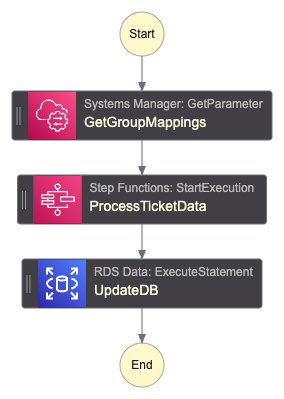
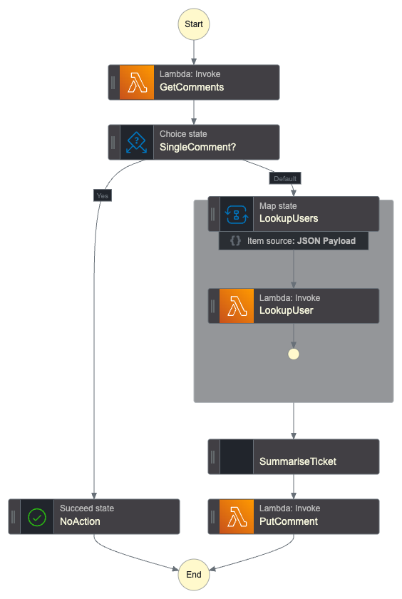

# Close Ticket Workflows

This module provisions Step Function workflows to handle actions when a support ticket is closed. There are 2 workflows that run when a ticket is closed.

## Record Ticket

This workflow updates the ticket data in the database. It records the the group the ticket was assigned to when it is closed. We use this as the label when training the model.

## Summarise Ticket

This workflow summarises the ticket activity using the Amazon Nova Lite model and adds it as a comment on the ticket. We look up the users so we can correctly attribute comments to the agent and customer.

# Generated Terraform Documentation

<!-- BEGIN_TF_DOCS -->
## Requirements

| Name | Version |
|------|---------|
|  [terraform](#requirement\_terraform) | >= 1.11.0, < 2.0.0 |
|  [aws](#requirement\_aws) | >= 6.0, < 7.0 |

## Providers

| Name | Version |
|------|---------|
|  [aws](#provider\_aws) | >= 6.0, < 7.0 |

## Modules

No modules.

## Resources

| Name | Type |
|------|------|
| [aws_cloudwatch_event_rule.solved_ticket](https://registry.terraform.io/providers/hashicorp/aws/latest/docs/resources/cloudwatch_event_rule) | resource |
| [aws_cloudwatch_event_target.record](https://registry.terraform.io/providers/hashicorp/aws/latest/docs/resources/cloudwatch_event_target) | resource |
| [aws_cloudwatch_event_target.summary](https://registry.terraform.io/providers/hashicorp/aws/latest/docs/resources/cloudwatch_event_target) | resource |
| [aws_cloudwatch_log_group.sfn_record](https://registry.terraform.io/providers/hashicorp/aws/latest/docs/resources/cloudwatch_log_group) | resource |
| [aws_cloudwatch_log_group.sfn_summary](https://registry.terraform.io/providers/hashicorp/aws/latest/docs/resources/cloudwatch_log_group) | resource |
| [aws_iam_policy.eb_solved_ticket](https://registry.terraform.io/providers/hashicorp/aws/latest/docs/resources/iam_policy) | resource |
| [aws_iam_policy.sfn_record](https://registry.terraform.io/providers/hashicorp/aws/latest/docs/resources/iam_policy) | resource |
| [aws_iam_policy.sfn_summary](https://registry.terraform.io/providers/hashicorp/aws/latest/docs/resources/iam_policy) | resource |
| [aws_iam_role.eb_solved_ticket](https://registry.terraform.io/providers/hashicorp/aws/latest/docs/resources/iam_role) | resource |
| [aws_iam_role.sfn_record](https://registry.terraform.io/providers/hashicorp/aws/latest/docs/resources/iam_role) | resource |
| [aws_iam_role.sfn_summary](https://registry.terraform.io/providers/hashicorp/aws/latest/docs/resources/iam_role) | resource |
| [aws_iam_role_policy_attachment.eb_solved_ticket](https://registry.terraform.io/providers/hashicorp/aws/latest/docs/resources/iam_role_policy_attachment) | resource |
| [aws_iam_role_policy_attachment.sfn_record](https://registry.terraform.io/providers/hashicorp/aws/latest/docs/resources/iam_role_policy_attachment) | resource |
| [aws_iam_role_policy_attachment.sfn_summary](https://registry.terraform.io/providers/hashicorp/aws/latest/docs/resources/iam_role_policy_attachment) | resource |
| [aws_sfn_state_machine.record](https://registry.terraform.io/providers/hashicorp/aws/latest/docs/resources/sfn_state_machine) | resource |
| [aws_sfn_state_machine.summary](https://registry.terraform.io/providers/hashicorp/aws/latest/docs/resources/sfn_state_machine) | resource |
| [aws_bedrock_foundation_model.summary](https://registry.terraform.io/providers/hashicorp/aws/latest/docs/data-sources/bedrock_foundation_model) | data source |
| [aws_caller_identity.current](https://registry.terraform.io/providers/hashicorp/aws/latest/docs/data-sources/caller_identity) | data source |
| [aws_iam_policy_document.eb_solved_ticket](https://registry.terraform.io/providers/hashicorp/aws/latest/docs/data-sources/iam_policy_document) | data source |
| [aws_iam_policy_document.eb_solved_ticket_assume](https://registry.terraform.io/providers/hashicorp/aws/latest/docs/data-sources/iam_policy_document) | data source |
| [aws_iam_policy_document.sfn_assume](https://registry.terraform.io/providers/hashicorp/aws/latest/docs/data-sources/iam_policy_document) | data source |
| [aws_iam_policy_document.sfn_record](https://registry.terraform.io/providers/hashicorp/aws/latest/docs/data-sources/iam_policy_document) | data source |
| [aws_iam_policy_document.sfn_summary](https://registry.terraform.io/providers/hashicorp/aws/latest/docs/data-sources/iam_policy_document) | data source |
| [aws_lambda_function.ticket_update](https://registry.terraform.io/providers/hashicorp/aws/latest/docs/data-sources/lambda_function) | data source |
| [aws_partition.current](https://registry.terraform.io/providers/hashicorp/aws/latest/docs/data-sources/partition) | data source |
| [aws_region.current](https://registry.terraform.io/providers/hashicorp/aws/latest/docs/data-sources/region) | data source |

## Inputs

| Name | Description | Type | Default | Required |
|------|-------------|------|---------|:--------:|
|  [application\_name](#input\_application\_name) | Name for the application. Used to prefix resources provisioned by this module. | `string` | n/a | yes |
|  [db\_cluster\_arn](#input\_db\_cluster\_arn) | ARN of the existing RDS Aurora cluster | `string` | n/a | yes |
|  [db\_secret\_arn](#input\_db\_secret\_arn) | ARN of the existing RDS Aurora secret | `string` | n/a | yes |
|  [eventbus](#input\_eventbus) | Name of the existing EventBridge event bus | `string` | n/a | yes |
|  [kms\_key\_arn](#input\_kms\_key\_arn) | The ARN of the KMS key to use for encryption at rest | `string` | n/a | yes |
|  [lambda\_ticket\_comments](#input\_lambda\_ticket\_comments) | ARN of the PicoFun Lambda function used to fetch the ticket comments | `string` | n/a | yes |
|  [lambda\_ticket\_update](#input\_lambda\_ticket\_update) | ARN of the PicoFun Lambda function used to update the ticket. Override to use the dummy function to run workflows in report only mode. | `string` | n/a | yes |
|  [lambda\_user\_get](#input\_lambda\_user\_get) | ARN of the PicoFun Lambda function used to fetch user details | `string` | n/a | yes |
|  [role\_namespace](#input\_role\_namespace) | Namespace/prefix for the Lambda execution role | `string` | n/a | yes |
|  [role\_permissions\_boundary](#input\_role\_permissions\_boundary) | Permissions boundary to apply to the Step Function execution role | `string` | n/a | yes |
|  [sfn\_ticket\_data\_name](#input\_sfn\_ticket\_data\_name) | Name of the Step Function for the ticket data workflow | `string` | n/a | yes |
|  [ssm\_params](#input\_ssm\_params) | SSM parameters used to configure workflow customisations | <pre>object({     group_mappings = string   })</pre> | n/a | yes |
|  [tags](#input\_tags) | Tags to apply to all resources | `map(string)` | n/a | yes |

## Outputs

| Name | Description |
|------|-------------|
|  [step\_function\_record\_arn](#output\_step\_function\_record\_arn) | ARN of the data recording Step Function |
|  [step\_function\_summary\_arn](#output\_step\_function\_summary\_arn) | ARN of the summary Step Function |
<!-- END_TF_DOCS -->