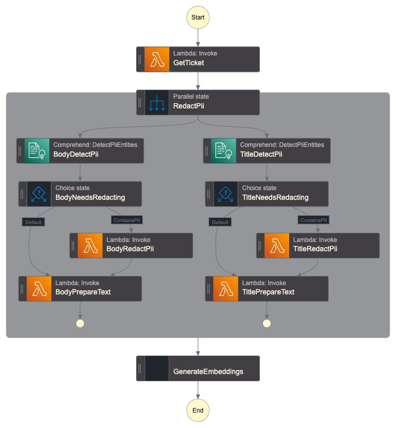

# Ticket Data Workflow

Processes and prepares ticket data for storage in the database and model training. This workflow handles PII detection, redaction, text normalization, and embedding generation.

## Purpose

This workflow is invoked when tickets are created or closed to ensure the database contains clean, consistent data for:

- Model training datasets
- Real-time routing inference
- Audit and compliance requirements

## Processing Steps

The workflow executes the following steps:

1. **Fetch current ticket** - Retrieves the latest ticket state via PicoFun Lambda to account for changes since the event fired
2. **PII detection** - Uses Amazon Comprehend to identify Personally Identifiable Information in title and body
3. **PII redaction** - If PII is found, invokes the redaction Lambda to remove sensitive data (using Lambda is more efficient than Comprehend's native redaction)
4. **Text normalization** - Cleans and standardizes text via the prepare-text Lambda (removes signatures, expands contractions, etc.)
5. **Lowercase conversion** - Ensures consistent casing for model input
6. **Combine fields** - Merges title and body into a single text field
7. **Generate embeddings** - Creates vector embeddings using Amazon Titan Embed model
8. **Store in database** - Writes the processed data to Aurora for retrieval by other workflows

## Configuration

The workflow requires Lambda ARNs for:

- `ticket_get` - PicoFun Lambda function to fetch ticket from Zendesk API
- `redact` - Utility Lambda function to redact PII from text
- `prepare_text` - Lambda function to normalize and clean ticket text

## PII Handling

The workflow uses Amazon Comprehend to detect common PII types (names, addresses, credit cards, etc.) and automatically redacts them before storage. This ensures training data and stored tickets comply with data protection requirements.

# Generated Terraform Documentation

<!-- BEGIN_TF_DOCS -->
## Requirements

| Name | Version |
|------|---------|
|  [terraform](#requirement\_terraform) | >= 1.11.0, < 2.0.0 |
|  [aws](#requirement\_aws) | >= 6.0, < 7.0 |

## Providers

| Name | Version |
|------|---------|
|  [aws](#provider\_aws) | >= 6.0, < 7.0 |

## Modules

No modules.

## Resources

| Name | Type |
|------|------|
| [aws_cloudwatch_log_group.sfn_new_ticket](https://registry.terraform.io/providers/hashicorp/aws/latest/docs/resources/cloudwatch_log_group) | resource |
| [aws_iam_policy.sfn_ticket_data](https://registry.terraform.io/providers/hashicorp/aws/latest/docs/resources/iam_policy) | resource |
| [aws_iam_role.sfn_ticket_data](https://registry.terraform.io/providers/hashicorp/aws/latest/docs/resources/iam_role) | resource |
| [aws_iam_role_policy_attachment.sfn_ticket_data](https://registry.terraform.io/providers/hashicorp/aws/latest/docs/resources/iam_role_policy_attachment) | resource |
| [aws_sfn_state_machine.this](https://registry.terraform.io/providers/hashicorp/aws/latest/docs/resources/sfn_state_machine) | resource |
| [aws_bedrock_foundation_model.titan_embed](https://registry.terraform.io/providers/hashicorp/aws/latest/docs/data-sources/bedrock_foundation_model) | data source |
| [aws_caller_identity.current](https://registry.terraform.io/providers/hashicorp/aws/latest/docs/data-sources/caller_identity) | data source |
| [aws_iam_policy_document.sfn_ticket_data](https://registry.terraform.io/providers/hashicorp/aws/latest/docs/data-sources/iam_policy_document) | data source |
| [aws_iam_policy_document.sfn_ticket_data_assume](https://registry.terraform.io/providers/hashicorp/aws/latest/docs/data-sources/iam_policy_document) | data source |
| [aws_partition.current](https://registry.terraform.io/providers/hashicorp/aws/latest/docs/data-sources/partition) | data source |
| [aws_region.current](https://registry.terraform.io/providers/hashicorp/aws/latest/docs/data-sources/region) | data source |

## Inputs

| Name | Description | Type | Default | Required |
|------|-------------|------|---------|:--------:|
|  [kms\_key\_arn](#input\_kms\_key\_arn) | The ARN of the KMS key to use for encryption at rest | `string` | n/a | yes |
|  [lambda\_prepare\_text](#input\_lambda\_prepare\_text) | ARN of the Lambda function used to prepare the text | `string` | `"gata-prepare-text"` | no |
|  [lambda\_redact](#input\_lambda\_redact) | ARN of the Lambda function used to redact text | `string` | `"util-fns-redact"` | no |
|  [lambda\_ticket\_get](#input\_lambda\_ticket\_get) | ARN of the PicoFun zendesk\_get\_api\_v2\_tickets\_ticket\_id Lambda function used to fetch the ticket | `string` | `"zendesk_get_api_v2_tickets_ticket_id"` | no |
|  [role\_namespace](#input\_role\_namespace) | Namespace/prefix for the Lambda execution role | `string` | `""` | no |
|  [role\_permissions\_boundary](#input\_role\_permissions\_boundary) | Permissions boundary to apply to the Step Function execution role | `string` | `null` | no |
|  [tags](#input\_tags) | Tags to apply to all resources | `map(string)` | `{}` | no |

## Outputs

| Name | Description |
|------|-------------|
|  [sfn\_arn](#output\_sfn\_arn) | ARN of the Step Function |
|  [sfn\_name](#output\_sfn\_name) | Name of the Step Function |
<!-- END_TF_DOCS -->